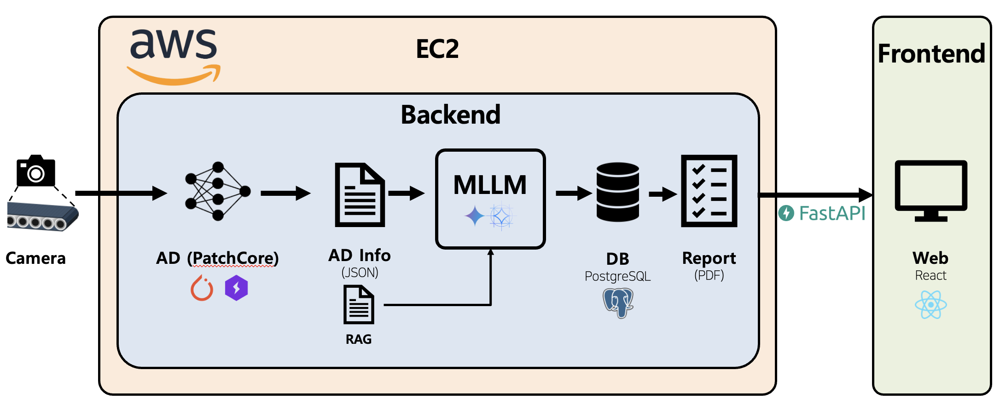

<div align="center">

<h1>Smart Factory Anomaly Reporting System</h1>

<p>
  <strong>Multimodal Anomaly Detection with Automated Defect Report Generation</strong><br>
  End-to-end pipeline: Image → Anomaly Detection → Heatmap → Structured Defect Info → LLM Report
</p>

<p>
  
  
  
  
  
  
  
  
</p>

https://github.com/user-attachments/assets/a9c36ca3-5f5e-4425-a644-5457553208bb

</div>

---

## Overview

**Smart Factory Anomaly Reporting System** is an end-to-end multimodal pipeline that goes beyond conventional anomaly detection. Instead of just producing heatmaps, it automatically generates structured defect reports — including cause, location, and recommended actions — using LLMs augmented with domain knowledge and visual retrieval.

Key capabilities:
- **Anomaly Detection** via [Anomalib](https://github.com/open-edge-platform/anomalib) (PatchCore / EfficientAD / WinCLIP)
- **Structured Defect Extraction** from heatmaps (location, area, severity)
- **Dual RAG**: Knowledge RAG (Chroma + domain JSON) + Visual RAG (DINOv2 few-shot)
- **Multi-LLM Support**: GPT-4o, Claude Sonnet, Gemini 2.5, InternVL, Gemma3, Qwen, LLaVA
- **Production API**: Async FastAPI pipeline with PostgreSQL + React dashboard
- **Evaluated on [MMAD Benchmark](https://arxiv.org/abs/2410.09453)** — outperforms paper-reported GPT-4o SOTA

---

## Table of Contents

- [Results](#-results)
- [System Architecture](#️-system-architecture)
- [RAG Pipeline](#-rag-pipeline)
- [Supported Models](#-supported-models)
- [Installation](#️-installation)
- [Quick Start](#-quick-start)
- [Project Structure](#-project-structure)
- [Citation](#-citation)

---

## 📊 Results

Evaluated on the [MMAD](https://arxiv.org/abs/2410.09453) MCQ evaluation protocol.
**Gemma3-27B INT4 + AD + RAG achieves 75.1%, surpassing the paper-reported GPT-4o SOTA (74.9%).**

> Evaluation set: GoodsAD (6 classes) + MVTec-LOCO (4 classes, `splicing_connectors` excluded), 99 images total, 1-shot

### LLM Benchmark (LLM Only, No AD / No RAG)

| Type | Model | Params | Accuracy (%) | Latency (s/img) |
|:-----|:------|:------:|:------------:|:---------------:|
| API | Gemini 3.0 Flash | — | **83.1** | 21.2 |
| API | Gemini 2.5 Flash | — | 76.7 | 10.1 |
| API | Gemini 2.5 Flash Lite | — | 69.6 | 0.9 |
| Open Source | Gemma3 | 27B | 68.7 | 17.1 |
| Open Source | Gemma3 INT4 | 27B | 66.4 | 6.7 |
| Open Source | Gemma3 | 12B | 69.8 | 11.8 |
| Open Source | Gemma3 INT4 | 12B | 60.0 | 6.8 |
| Open Source | InternVL3.5 | 8B | 61.1 | 3.8 |
| Open Source | Qwen3-VL | 8B | 60.0 | 3.9 |

### PatchCore + RAG Effect (Selected Models)

> AD Model: PatchCore (all settings below)

| Model | Params | Setting | Accuracy |
|:------|:------:|:--------|:--------:|
| Gemma3 INT4 | 27B | AD + LLM | 66.4% |
| **Gemma3 INT4** | **27B** | **AD + LLM + RAG** | **75.1%** |
| Gemini 2.5 Flash Lite | — | AD + LLM | 69.6% |
| **Gemini 2.5 Flash Lite** | **—** | **AD + LLM + RAG** | **74.7%** |

> RAG improves Gemma3-27B INT4 by **+8.7%p** and Gemini 2.5 Flash Lite by **+5.1%p**.

---

## 🏗️ System Architecture

<div align="center">

</div>

**Production Pipeline** (async):
`POST /inspect` → `AdService.predict_batch()` → PostgreSQL initial save → ThreadPoolExecutor (RAG + LLM) → PostgreSQL final update  
Watchdog: records stuck in `processing` for 120+ seconds are automatically marked as `failed`.

---

## 🔎 RAG Pipeline

### Knowledge RAG

`domain_knowledge.json` (`{dataset → category → defect_type → description}`) → Chroma Vector DB → Metadata Filter + Semantic Search → Prompt Injection

- Embedding: `paraphrase-multilingual-MiniLM-L12-v2`
- Vector DB: Chroma (local persist, `vectorstore/domain_knowledge/`)

### Visual RAG

DINOv2 (`dinov2_vits14`) Embedding → per-category `.pkl` index → top-k similar normal images as few-shot examples

```python
from src.rag.visual_rag import VisualRAG

vrag = VisualRAG(index_dir="rag/")
vrag.build_all(dataset_root="dataset/MMAD")      # build per-category pkl index
results = vrag.search(query_image_path, category="carpet", k=1)
```

---

## 🤖 Supported Models

| Type | Model Key | Notes |
|:-----|:----------|:------|
| **API** | `gpt-4o`, `gpt-4o-mini` | OpenAI |
| **API** | `claude` | Anthropic Claude Sonnet 4 |
| **API** | `gemini-2.5-flash`, `gemini-2.5-pro` | Google |
| **Local** | `internvl`, `internvl3.5-2b` | InternVL3.5 (1B–8B) |
| **Local** | `gemma3`, `gemma3-12b-int4` | Gemma3 (4B/12B/27B, INT4/INT8) |
| **Local** | `qwen`, `qwen-7b` | Qwen2.5-VL / Qwen3-VL |
| **Local** | `llava` | LLaVA v1.5/v1.6 |

---

## 🛠️ Installation

### Requirements

- Python ≥ 3.10
- CUDA 12.1+ (for GPU inference) / CPU supported
- Docker & Docker Compose (for deployment)
- PostgreSQL (for API server)

### 1. Clone

```bash
git clone https://github.com/<org>/smart-factory-anomaly-report.git
cd smart-factory-anomaly-report
```

### 2. Install Dependencies

```bash
# Install uv (if not present)
curl -LsSf https://astral.sh/uv/install.sh | sh

# Reproducible install from lockfile
uv sync --frozen
```

### 3. Environment Variables

```bash
cp .env.example .env
# Edit .env: DATABASE_URL, API keys, etc.
```

| Variable | Default | Description |
|:---------|:--------|:------------|
| `DATABASE_URL` | `postgresql://localhost/inspection` | PostgreSQL connection |
| `LLM_MODEL` | `internvl` | Default LLM |
| `AD_CHECKPOINT_DIR` | `checkpoints/` | PatchCore checkpoint root |
| `RAG_ENABLED` | `true` | Visual RAG |
| `DOMAIN_RAG_ENABLED` | `true` | Knowledge RAG |

---

## 🚀 Quick Start

### Docker (Recommended)

```bash
docker compose up -d
```

Starts PostgreSQL + FastAPI (port 8000) + React/nginx (port 80).

### Manual

```bash
# AD Model training
python scripts/train_anomalib.py

# MMAD benchmark evaluation
python scripts/run_experiment.py --llm gemma3 --ad-model patchcore --rag
python scripts/run_experiment.py --list-models    # list available models

# API server
uvicorn apps.api.main:app --reload --port 8000

# React frontend
cd apps/frontend && npm ci && npm run dev -- --host 0.0.0.0 --port 5173
```

### Inference via API

```bash
curl -X POST http://localhost:8000/inspect \
  -F "file=@sample.jpg" \
  -F "category=carpet" \
  -F "dataset=MVTec-LOCO"
```

---

## 📁 Project Structure

```
smart-factory-anomaly-report/
├── apps/
│   ├── api/              # FastAPI server (production pipeline)
│   ├── dashboard/        # Streamlit UI
│   └── frontend/         # React frontend
├── configs/
│   ├── experiment.yaml   # MMAD benchmark config
│   ├── anomaly.yaml      # Anomalib training config
│   └── ad_policy.json    # AD decision thresholds (3-tier)
├── docs/                 # Deployment · experiment · pipeline docs
├── scripts/              # Training / inference / evaluation CLI
├── src/
│   ├── mllm/             # MLLM clients + factory
│   ├── rag/              # Knowledge RAG (Chroma) + Visual RAG (DINOv2)
│   ├── service/          # AdService · LlmService · Pipeline
│   ├── storage/          # PostgreSQL / SQLite
│   ├── structure/        # Heatmap → structured defect
│   └── eval/             # AUROC · PRO · Dice · IoU metrics
├── docker-compose.yml
└── pyproject.toml
```

---

## 📄 Documentation

| Document | Description |
|:---------|:------------|
| [`docs/deploy-and-handoff.md`](docs/deploy-and-handoff.md) | Server deployment guide |
| [`docs/experiment-runner.md`](docs/experiment-runner.md) | Benchmark experiment config |
| [`docs/report-pipeline-guide.md`](docs/report-pipeline-guide.md) | Report generation pipeline |
| [`docs/incoming-auto-ingest.md`](docs/incoming-auto-ingest.md) | Filesystem auto-ingest setup |

---

## 🙏 Acknowledgements

- [Anomalib](https://github.com/open-edge-platform/anomalib) — anomaly detection backbone
- [MMAD](https://arxiv.org/abs/2410.09453) — evaluation benchmark and dataset
- [DINOv2](https://github.com/facebookresearch/dinov2) — visual RAG backbone

---

## 📝 Citation

If you find this project useful, please cite the MMAD benchmark:

```bibtex
@article{jiang2024mmad,
  title={MMAD: The First-Ever Comprehensive Benchmark for Multimodal LLMs in the Industrial Anomaly Detection Domain},
  author={Jiang, Xi and others},
  journal={arXiv preprint arXiv:2410.09453},
  year={2024}
}
```

---

## License

This project is licensed under the [MIT License](LICENSE).
